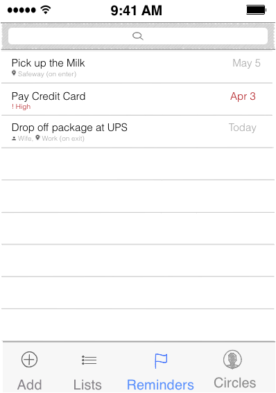
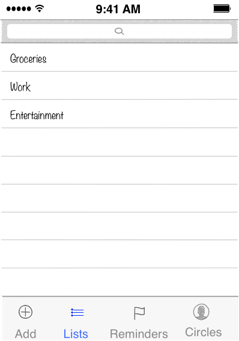
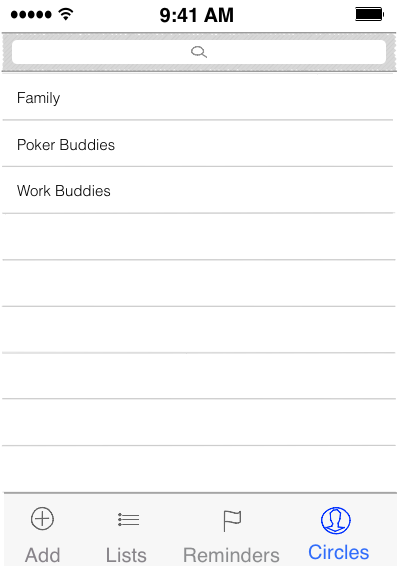

# GoTeam

## User Stories ##
1. When adding a new task, the user will be prompted to enter a location, date, social contact, list name, or a priority level. See the "Add a new reminder" wireframe for the UI. To differentitate our app, when a new task is added, we may empahsize and prompt the user to augment the reminder with a Location or a Social contact
2. The location based reminders will setup geo fencing areas, within a certain radius of the location. User can then choose to be notified upon entering or exiting the geo fenced area
3. User can create a social circle using the contact list on their phone. Once the social circle has been created, user can send a reminder to a contact on the social circle.
4. When user adds their contact name to a social circle, then the app requests an approval. If the contact name is an existing user of the app, then the approval is requested in the app. If not then the app sends an invite email or an SMS with a link to AppStore. i.e. User either receives push notification or email or SMS with information that someone would like to add them to their social circle. User is able to approve or reject the incomming request.
5. User has the ability to edit an existing social circle, add and remove contacts from an existing social circle and also to delete an existing social circle.
6. User has the ability to create a new reminder, edit and delete an existing reminder. Sames goes for reminder lists
7. User can set and edit reminder priority level for new and existing reminders 
8. User can set and edit reminder alert type for new and existing reminders. Supported alert types are push notifications, SMS and email
9. User can add the reminder to either a pre-existing list or create a new list into which to add a reminder. 
10.User has the ability to edit an existing location name and location coordinates and also to delete an existing location.

## Wireframes ##

### 1. Add a new reminder ### 

***

### 2. List of all Reminders ### 

***

### 3. List of task lists ### 

***

###  4. View and Edit Social Circles ### 

***

###  5. Choose a location using a map interface ### 

***

